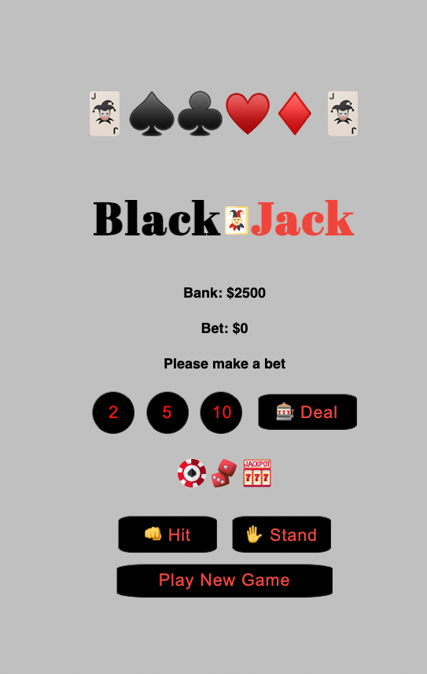

# Blackjack 🃏

 
 Blackjack is a card game in which the objective is to achieve a hand value of 21 or les while susrpassing the dealer's hand. PLayers begin by choosing bets range from $2 to $5 and then clicking the "Deal" button. Throughout the game, players can decide to click "hit" or "stand" button based on the strength of their current hand. Exceeding a hand value of 21 results in a loss for the players. Players can click "Play New Game " to resetart the game. 

**[Play the game here](https://blackjack-jw-1.netlify.app/)**

# Technologies used 💻

* CSS
* Javascript
* HTML
* Git

# Attributions 💌
* assets/audio

# Ice Box 🧊 
- [ ] Disable Hit and Stand Button until players click Deal button
- [ ] Confetti
- [ ] celebration animations
- [ ] celebrating sound effect
- [ ] library for fun winning/losing messages
- [ ] dark/light mode
- [x] add fonts
- [x] add card passing sound

