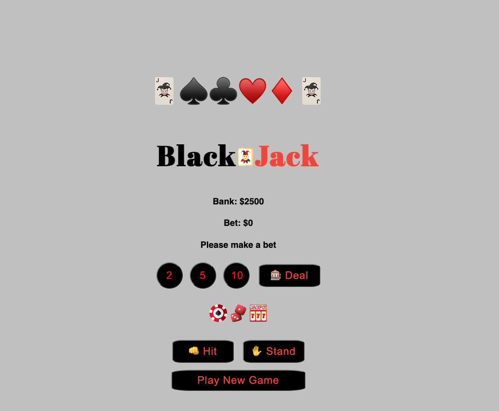

# 🃏 Blackjack 

 
 Blackjack is a card game in which the objective is to achieve a hand value of 21 or les while susrpassing the dealer's hand. PLayers begin by choosing bets range from $2 to $5 and then clicking the "Deal" button. Throughout the game, players can decide to click "hit" or "stand" button based on the strength of their current hand. Exceeding a hand value of 21 results in a loss for the players. Players can click "Play New Game " to resetart the game. 

 I choose this game because ti is a low-entry barrier game. 

## **[Play the game here](https://blackjack-jw-1.netlify.app/)**

# 💻 Technologies used 

* 
* 
* 
* 

# 💌 Attributions 
* assets/audio

* [poker-card. wav](https://freesound.org/people/fartheststar/sounds/201808/#comments)
* [coin.wave](https://freesound.org/people/LittleRobotSoundFactory/sounds/276220/)

* [jazz music.mp3](https://freesound.org/people/NikoSardas/sounds/456797/)

* [wrong.mp3](https://freesound.org/people/jalastram/sounds/208883/)
* [joker puff.png](https://www.flaticon.com/free-icon/joker_594926)
* [jackpot-machine.png](https://www.flaticon.com/free-icon/jackpot-machine_2460454)
* [3d-dice.png](https://www.flaticon.com/free-icon/3d-dice_10490256)
* [casino.png](https://www.flaticon.com/free-icon/poker_1036781)

# 🧊 Ice Box  
- [x] add fonts
- [x] add card passing sound
- [ ] Disable Hit and Stand Button until players click Deal button
- [ ] Confetti
- [ ] celebration animations
- [ ] celebrating sound effect
- [ ] library for fun winning/losing messages
- [ ] dark/light mode

